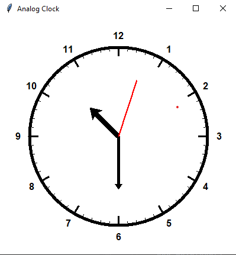

# Analog Clock

Analog Clock is a simple Python application built using the Tkinter library that displays an analog clock interface with hour, minute, and second hands. This project serves as a basic demonstration of GUI development with Tkinter and basic trigonometry for hand positioning.

## Features

- Analog clock interface displaying hour, minute, and second hands.
- Hour marks and numbers for easy time reading.
- Dynamic update of the clock's hands to reflect the current time.

## Requirements

- Python 3.x
- Tkinter library (usually included in standard Python installations)

4. The analog clock interface will be displayed, showing the current time.

## Screenshots

